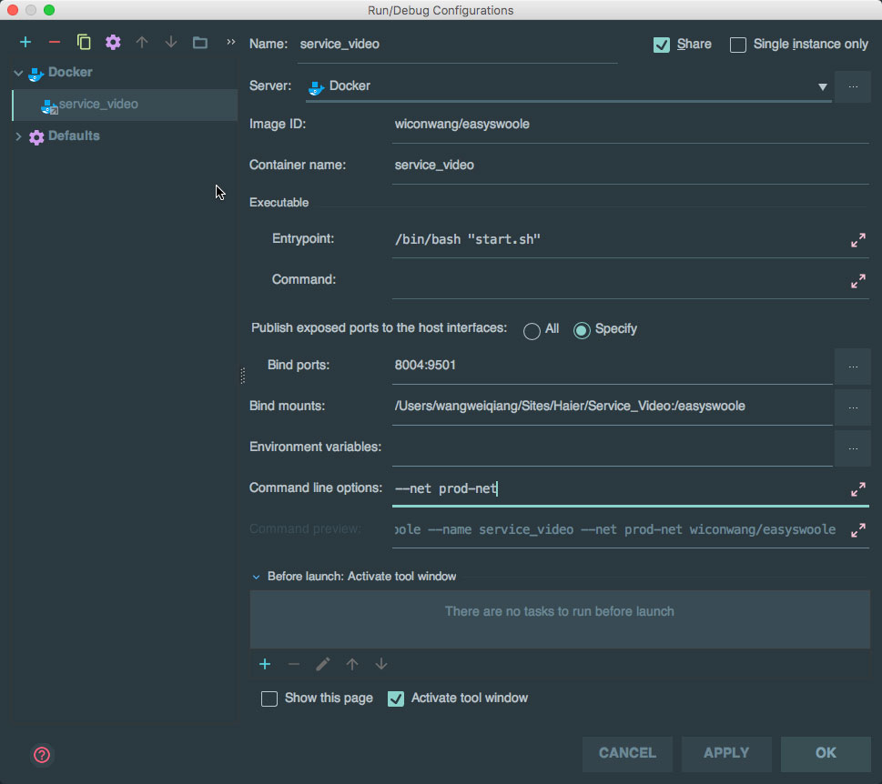

# 安装 
基于本项目 Dockerfile 部署项目    
逻辑：容器启动时，加载项目下的 startup.sh 文件，启动PHP服务并占用 80 端口开放服务，对外映射为 8006 端口（映射端口按需求调整）  
目录： /home/service_site_prod/（按需求调整）   
影像：image_service_site_prod    
工作容器：service_site_prod  

## 1. Docker安装
下载安装Docker主环境

## 2. 创建项目文件夹 并 检出项目到此文件夹
`mkdir /home/service_site_prod`  

## 3. 确认网络情况
建议基于虚拟网络运行，请使用 `docker network ls` 查询网络 `prod-net` 是否存在。     
不存在请使用以下命令新建
```
docker network create --driver=bridge --subnet=172.100.0.0/16 prod-net
```

## 4. 构建影像   
想一个影像名，进入目录    
然后用下一行命令构建：   
```
cd /home/service_site_prod
docker build -t image_service_site_prod  -f ./Dockerfile .
```  


## 5. 环境构建

### 5.1. 场景一：本地研发   
研发环境推荐生成容器，手动启动容器和启动应用。    
请勿设置自动启动，以便出错时无法正常进入容器。    
1. 复制 dev.example.php 为dev.php 并配置数据库部分
2. 创建容器  
``` 
docker run -ti -p 8006:80  -v /home/service_site_prod:/var/www/  --name service_site  --net prod-net -d  image_service_site_prod
```    
3. 进入容器： `docker exec -it service_site /bin/bash`    
4. 启动程序：  ` `  
    如果`composer.json`有变化，需要使用 `composer update` 安装    
然后可以使用 localhost:8006 访问项目了。     


### 5.2. 场景二：Jet Brains 相关 IDE  
直接在编辑器中配置：

注意 Image ID项为第4步构建的映像： image_service_site_prod

### 5.3. 场景三：服务器部署（开发、测试、生产）环境  
生产环境使用自动重启，并指定启动bash，以便服务启动时，自动启动容器和项目    
```
docker run -ti -p 8006:80  -v /home/service_site_prod:/var/www/ --restart=always   --name service_site_prod --net prod-net -d  image_service_site_prod /var/www//start.sh
``` 
Jenkins部署时：
1.  `docker stop service_site_prod` 

4.  `docker start service_site_prod`


### 5.4. 场景四：Docker-composer部署

```
service_site_prod:
  build: /home/service_site_prod
  ports:
    - "80:80"
  volumes:
    - /home/service_site_prod:/var/www/
  container_name: service_site_prod
  command: /bin/bash -c "composer install && php var/www/ start"
  environment:
    - TZ=Asia/Shanghai
  restart: always
  networks:
    dev-net:
      ipv4_address: 172.20.0.35
    prod-net:
      ipv4_address: 172.21.0.35
```

:END